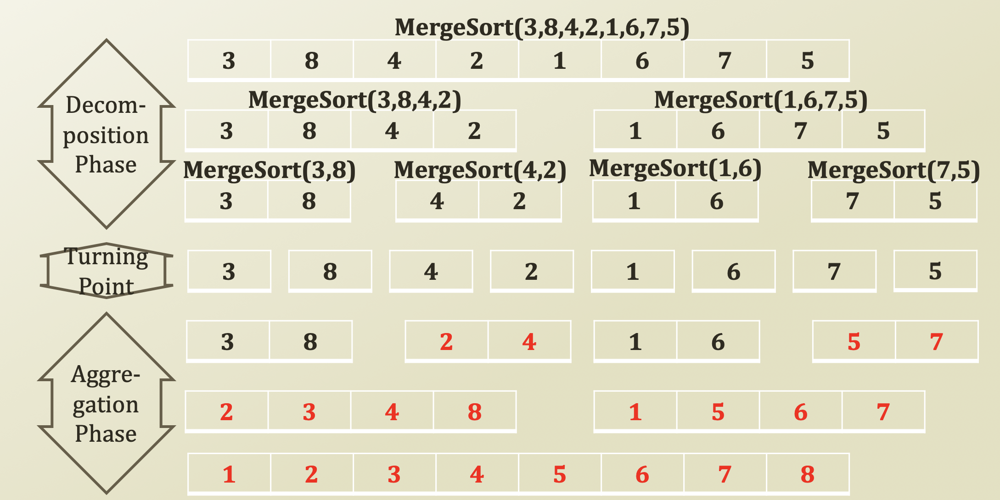

# 2\) Merge Sort and Problems in Recursions

## Merge Sort

* Merge sort: Onee example of recursive programming
  * Decompose into two smaller lists
  * Aggregate to one larger and sorted list



### Implementation Example: Merge Sort



```python
import random

def performMergeSort(lstElements):
    # Base Case. Termination Term
    if len(lstElements) == 1:
        return lstElements
        
    # Decomposition
    lstSubElements1 = []
    lstSubElements2 = []
    for i in range(len(lstElements)):
        if len(lstElements) / 2 > i:
            lstSubElements1.append(lstElements[i])
        else:
            lstSubElements2.append(lstElements[i])
    
    # Recursion
    lstSubElements1 = performMergeSort(lstSubElements1)
    lstSubElements2 = performMergeSort(lstSubElements2)
    
    # Aggregation
    idxCount1 = 0
    idxCount2 = 0
    for i in range(len(lstElements)):
        if idxCount1 == len(lstSubElements1):
            lstElements[i] = lstSubElements2[idxCount2]
            idxCount2 += 1
        elif idxCount2 == len(lstSubElements2):
            lstElements[i] = lstSubElements1[idxCount1]
            idxCount1 += 1
        elif lstSubElements1[idxCount1] > lstSubElements2[idxCount2]:
            lstElements[i] = lstSubElements2[idxCount2]
            idxCount2 += 1
        else:
            lstElements[i] = lstSubElements1[idxCount1]
            idxCount1 +=1
    return lstElements
        
# Execution Code
lstRandom = []
for i in range(0, 10):
    lstRandom.append(random.randrange(0, 100))
print(lstRandom)
lstRandom = performMergeSort(lstRandom)
print(lstRandom)
```



## Problems in Recursions of Fibonacci Sequence

* Problems in recursions
  * Excessive function calls
    * Calling functions again and again
    * Even though the function is executed before with the same parameters
* For instance, Fibonacci\(4\)

  

  * Has 2 repeated calls of F\(0\)
  * Has 3 repeated calls of F\(1\)
  * Has 2 repeated calls of F\(2\)

* These are unnecessarily taking time and space
* How to solve this problem?
  * Using **Dynamic Programming**, which is a store somewhere then you don't need to use twice.

