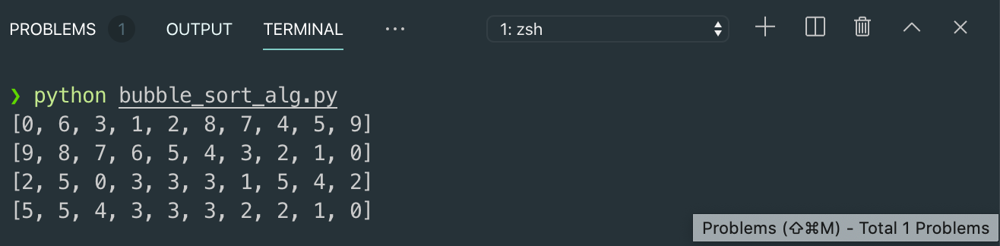

# 2. Bubble Sort Algorithm

## Bubble Sort Algorithm

* Example of Algorithms
  * Insertion, deletion, search of linked lists, stacks, queues,...
  * Sorting of linked lists . . . 
    * Various sorting methods
      * Bubble sort, Quick sort, Merge sort, . . . 
* Bubble Sort \(list\) Descending Order Pseudo Code
  * For i₁ = 0 to length\(list\)
    * For i₂ = i₁ + 1 to length\(list\)
      * If list\[i₁\] &lt; list\[i₂\]
        * Swap list\[i₁\], list\[i₂\]
  * Return list
* This program uses
  * Data Structure: List
  * Algorithm: Bubble Sort

```python
# Bubble Sort in Descending Order
import random

def performBubbleSort(lst):
    for i1 in range(0, len(lst)):
        for i2 in range(i1 + 1, len(lst)):
            if lst[i1] < lst[i2]:
                lst[i1], lst[i2] = lst[i2], lst[i1]
    return lst

N = 10
lstNumbers = list(range(N))
random.shuffle(lstNumbers)
print(lstNumbers)
print(performBubbleSort(lstNumbers))

lstNumbers2 = [2, 5, 0, 3, 3, 3, 1, 5, 4, 2]
print(lstNumbers2)
print(performBubbleSort(lstNumbers2))

```



* Let's observe the execution of the Bubble Sort
* \[2, 5, 0, 3, 3, 3, 1, 5, 4, 2\]
  * i₁ = 0, i₂ = 1, 2, 3, . . ., 9  → 9 iterations 
    * i₁ = 0, i₂ = 1 
      * 2 &lt; 5, hit and swap!
      * list\[0\] = 5, list\[1\] = 2 from now
      * \[5, 2, 0, 3, 3, 1, 5, 4, 2\]
    * i₁ = 0, i₂ = 2
      * 5 &lt; 0, No hit
    * i₁ = 0, i₂ = 3
      * 5 &lt; 3, No hit
    * . . .
  * i₁ = 1, i₂ = 2, 3, 4, . . ., 9  → 8 iterations
    * . . .
  * i₁ = 8, i₂ = 9, . . ., 9  → 1 iterations

    * . . .

 

  * Total iterations 
  * $$= 9 + 8 + . . . + 1$$ 
  * $$\text{using formula} \  \frac{n(n-1)}{2},$$ 
  * $$= \frac{10*9}{2}$$ 
  * $$= 45 \ \text{iterations}$$ 


