# 2. Terminologies of Tree Structure

## Terminologies of Tree Structure 1

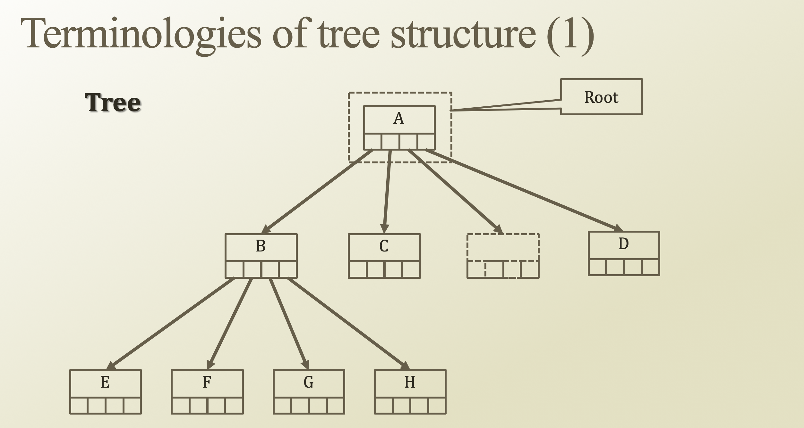

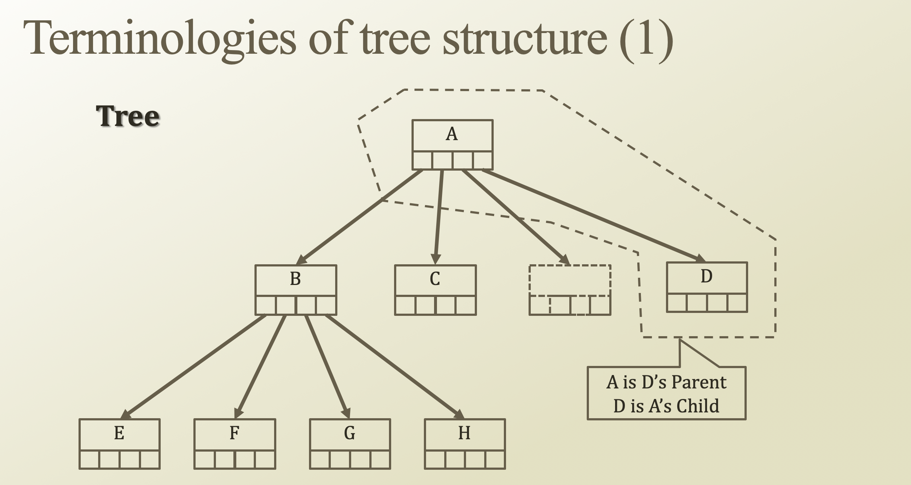

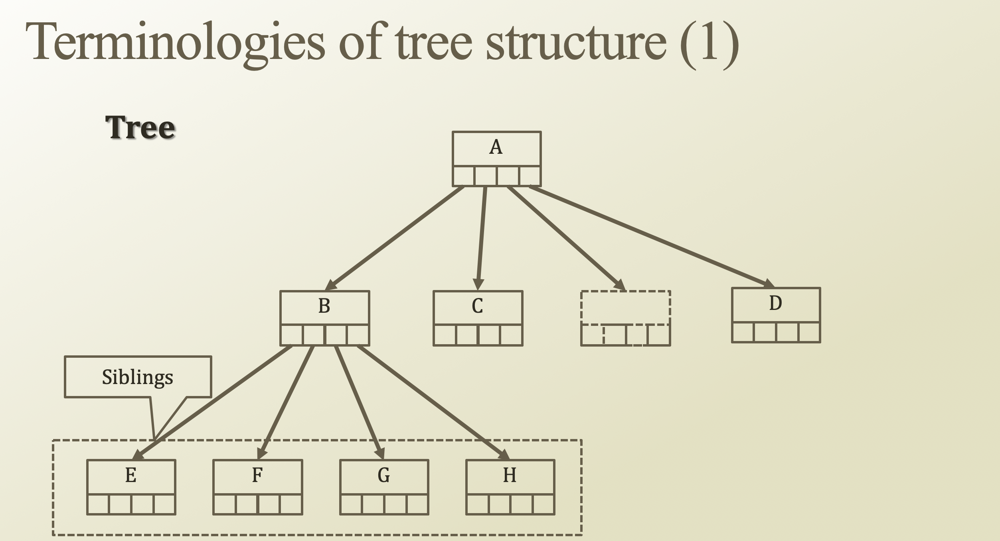

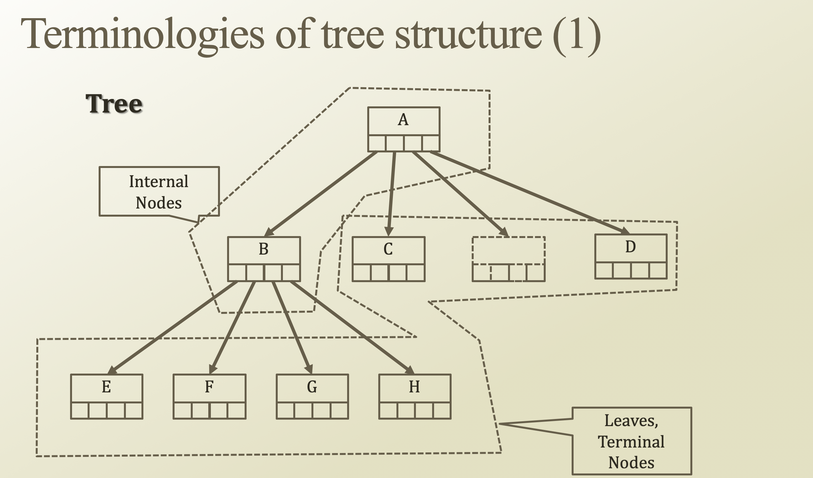

## Terminologies of Tree Structure 2

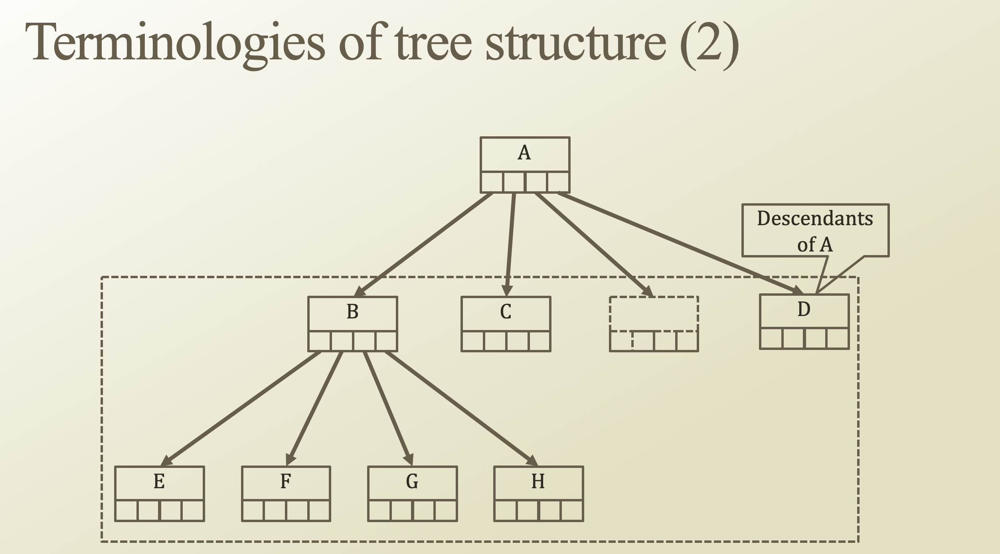

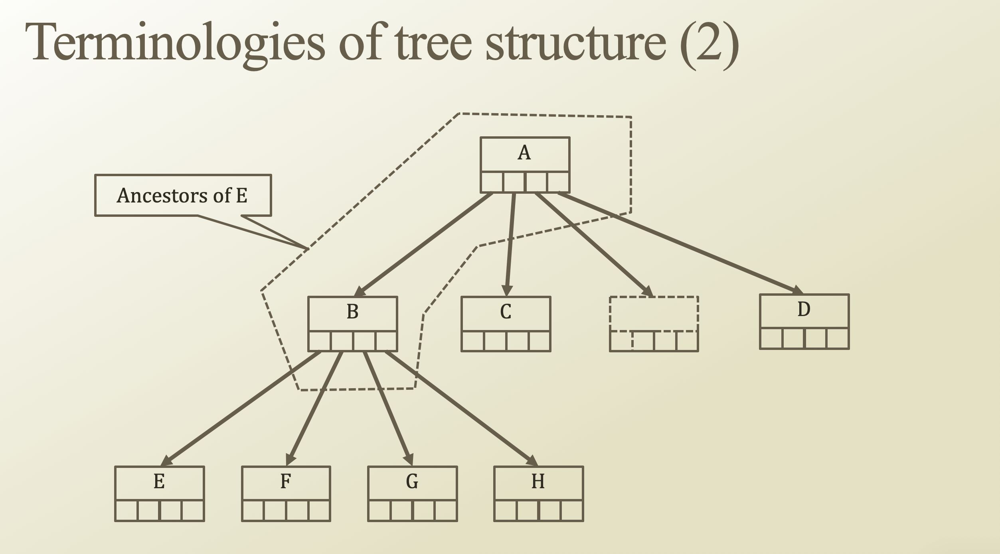

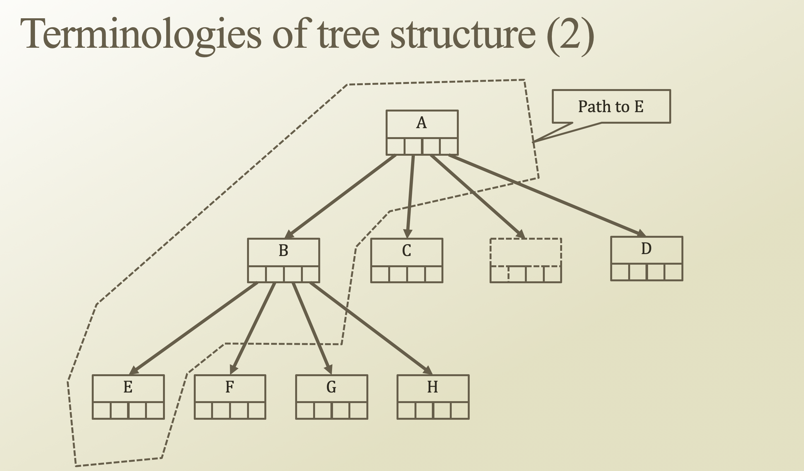

## Terminologies of Tree Structure 3

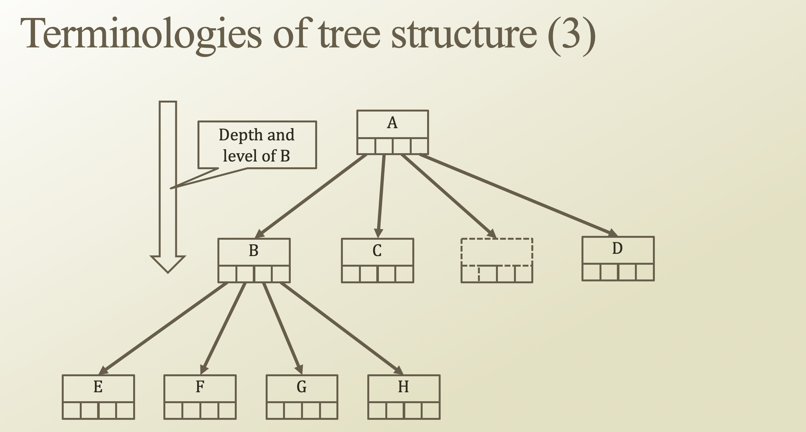

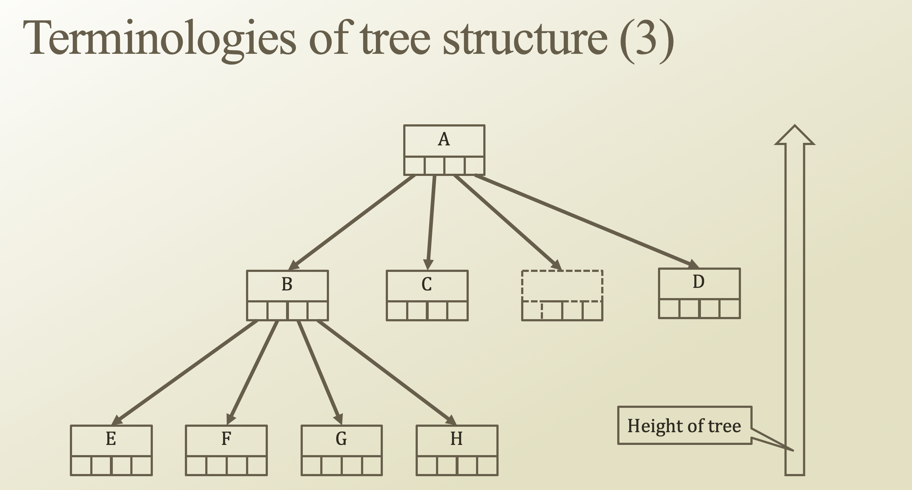

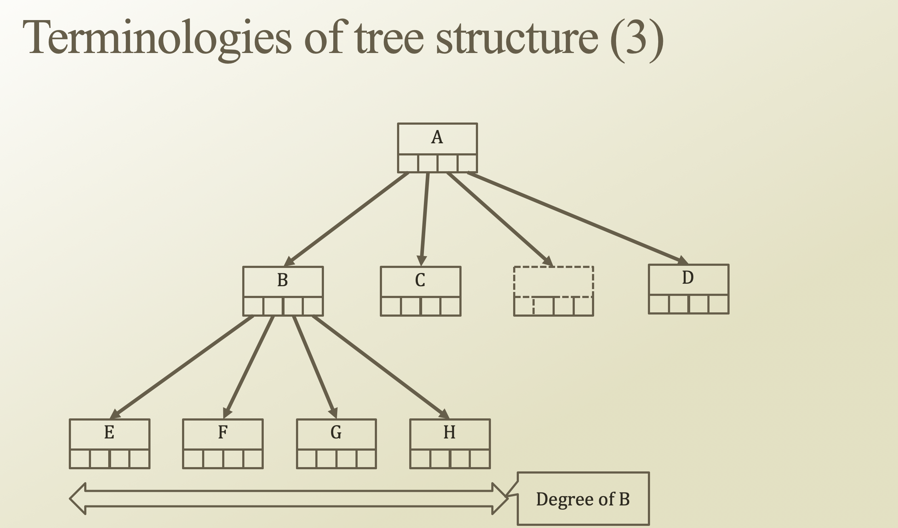

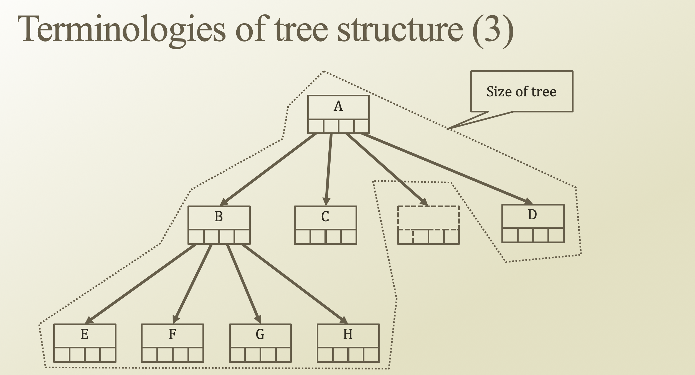

## Terminologies of Tree Structure 4

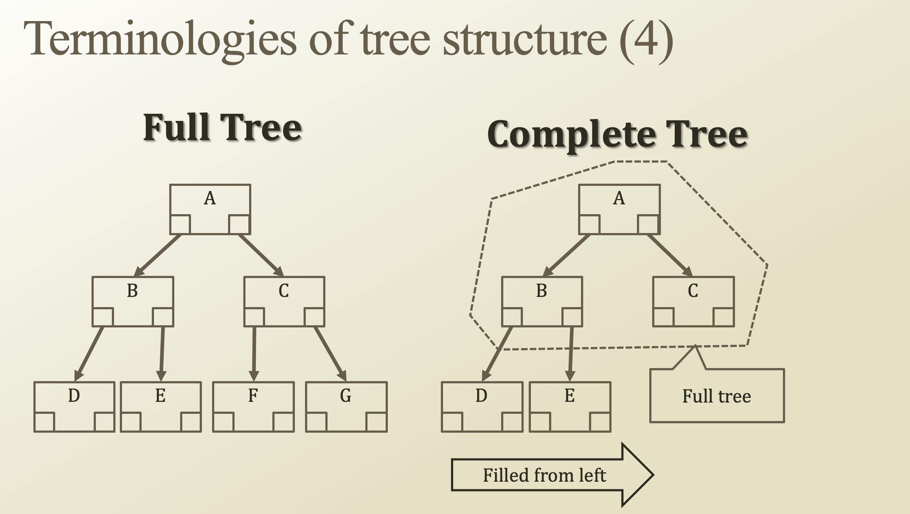

