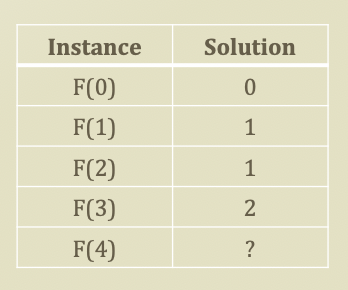
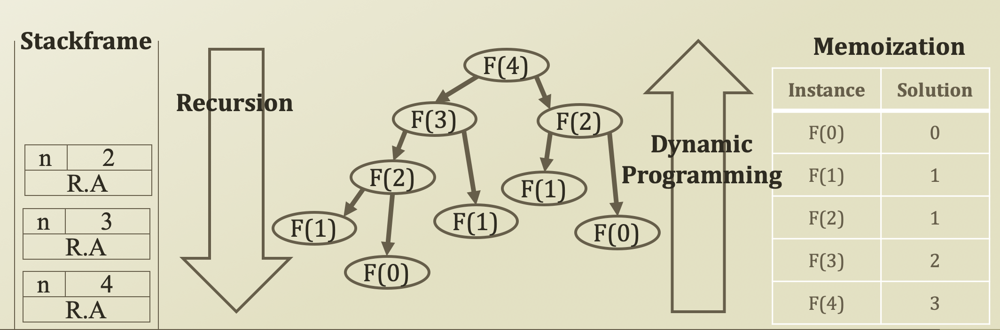

# 3. Dynamic Programming \(Memoization\)

## Dynamic Programming

### Dynamic Programming

* A general algorithm design technique for solving problems defined by or formulated as **recurrences with overlapping sub-instances** 
* In this context, Programming = Planning

### Main Storyline

* Setting up a recurrence
  * Relating a solution of a larger instance to solutions of some smaller instance
  * Solve small instances once
  * **Record solution in a table**
  * Extract a solution of a larger instance from the table

## Memoization

* Key technique of dynamic programming 
  * Simple put
    * **Storing the results** of previous function calls to reuse the results again in the future
  * More philosophical sense
    * Bottom-up approach to problem-solving 
      * Recursion: top-down of divide and conquer
      * Dynamic programming: Bottom-up \(smaller problems → big problem\) of storing and building

