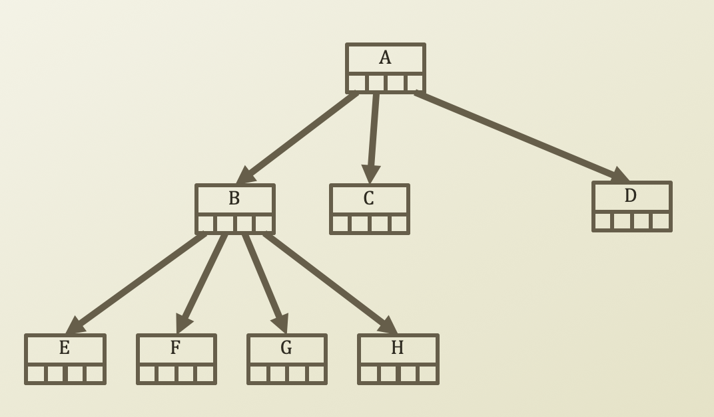

# 3. Characteristics of Tree

​

* Number of edges = number of nodes - 1
* Depth of root = 0
* Height of root = height of tree, i.e., maximum length of a terminal node
* Maximum number of nodes at level i with degree d = dⁱ
* Maximum number of leaves with height h and degree d = dʰ
* Maximum size of a tree with height h and degree d =
  * $$1 + d + d² + . . . + dʰ = \frac{d^{h+1} - 1}{d-1}$$ 
* Height of a **complete tree** with size s and degree d = 

  * $$⌈{log_d(s(d-1) + 1}⌉ - 1 $$ $$∵ \text{from} \ 1 + d + d² + . . . + dʰ = \frac{d^{h+1} - 1}{d-1},$$
    * ​$$\text{let} \ s = 1 + d + d² + . . . + dʰ  $$ 
    * $$s(d - 1) = d^{h + 1} - 1$$ 
    * $$s(d - 1) + 1 = d^{h + 1}$$  
    * $$h + 1 = log_d(s(d - 1) + 1)$$ 
    * Since h + 1 is an integer and log is a real number, we need to ceil log. Then,
    * $$∴  h = ⌈log_d(s(d-1) + 1)⌉ - 1$$ 

  * For example, if we have 16 nodes and degree of 4 then
  * $$h = ⌈log_4(16(4 - 1) + 1)⌉ - 1$$ 
  * $$\ \ \ \ = ⌈log_4(49)⌉ - 1$$ 
  * $$\ \ \ \ = ⌈2.\text{xxx}⌉ - 1$$ 
  * $$\ \ \ \ = 3 - 1 $$ 
  * $$\ \ \ \ = 2$$ 

