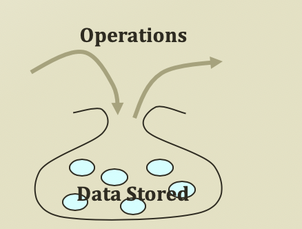

# 1. Abstract Data Types

## Scenario for List

* You are looking for Kim in the mass public
  * You are going to ask one by one "Are you Mr.Kim?"
  * Sometimes, you ask the question to a person multiple times
  * You realize that this is not going to work!
  * So, you line up the people and again ask the question one-by-one
* You are looking for a restroom on the floor
  * The floor has a long corridor, and every room has an entrance to the corridor
  * You only need to follow the corridor 
* You have a dump of information of customers
  * How to store, search, and manipulate the information
* You line them up as a **list**

## Abstract Data Types

* An abstract data type \(ADT\) is an abstraction of a data structure
  * An ADT specifies:
    * Data stored
    * Operations on the data
    * Error conditions associated with operations
* Example: ADT modeling a simple stock trading system
  * The data stored are buy/sell orders
  * The operations supported are
    * order buy \(stock, shares, price\)
    * order sell \(stock, shares, price\)
    * void cancel \(order\)
  * Error Conditions:
    * Buy/sell a nonexistent stock
    * Cancel a nonexistent order

