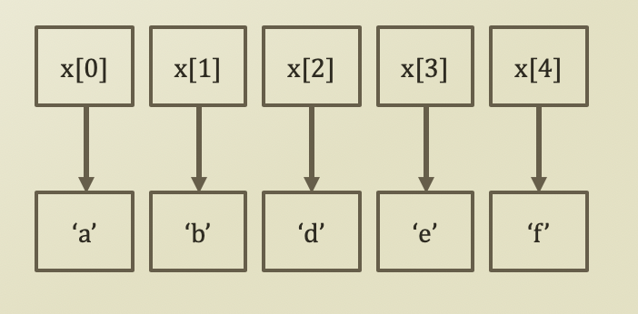
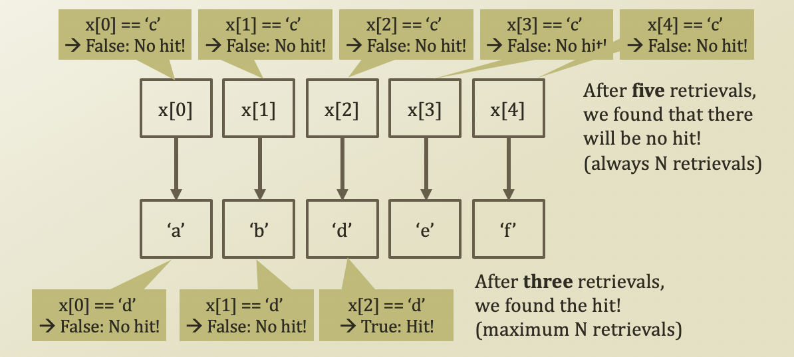
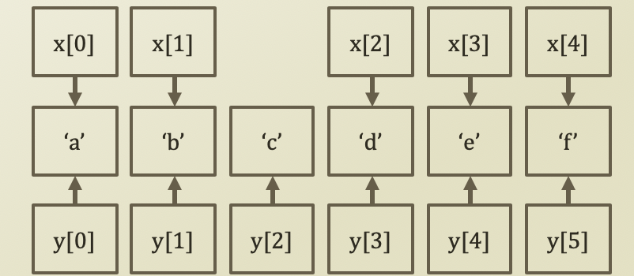
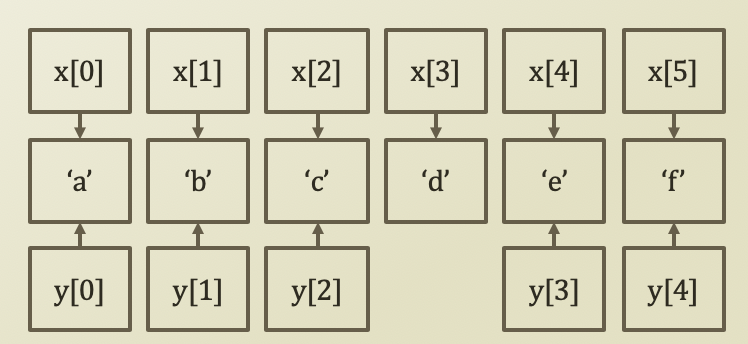

# 2. Array

## Creating a List by Array

* Array \(in our Python example, List, yet we will use only its index function\)
  * Each element is accessible by index
  * Index is typically zero or a positive integer 
  * Very simple creation
    * That's why people use it



```python
x = ['a', 'b', 'd', 'e', 'f']
```

## Search Procedure in Array

* Let's find 'd' and 'c' from the list in an array 
  * Of course, you can use 'in', but we commit ourselves to use indexes only 
* Then, navigating from the first to the last until a hit is the only way



## Insert Procedure in Array

* Let's insert 'c' between 'b' and 'd' in the list \(a = insert position index\)
  1. Make new list, or y, with six cells
  2. Copy the reference links of x\[0 : a - 1\] to y\[0 : a - 1\] \(retrieval count: a\)
  3. Put a reference link to 'c' in y\[a\] \(retrieval count: 1\)
  4. Copy the reference links of x\[a:\] to y\[a + 1:\] \(retrieval count: n - a - 1\)
  5. Change x's reference to y's reference
  6. Total count of retrievals = a + 1 + n - a - 1 = n



```python
x = ['a', 'b', 'd', 'e', 'f']
idxInsert = 2
valInsert = 'c'

y = list(range(6))

for i in range(0, idxInsert):
    y[i] = x[i]
    
y[idxInsert] = valInsert

for i in range(idxInsert, len(x)):
    y[i + 1] = x[i]
```

## Delete Procedure in Array

* Let's remove 'd' in the list \(a = delete position index\)
  1. Make new list, or y, with five cells
  2. Copy the reference links of x\[0 : a - 1\] to y\[0 : a - 1\] \(retrieval count: a\)
  3. Copy the reference links of x\[a + 1:\] to y\[a:\] \(retrieval count: n - a - 1\)
  4. Change x's reference to y's reference
  5. Total count of retrievals = a + n - a - 1 = n - 1



```python
idxDelete = 3

y = list(range(5))

for i in range(0, idxDelete):
    y[i] = x[i]
    
for i in range(idxDelete + 1, len(x)):
    y[i - 1] = x[i]
    
x = y
```

## Problems in Array

* Whenever you put something in or get something out 
  * You have to perform line-wise retrievals
    * Which is N retrievals \(by assuming 100,000 - 1 ≈ 100,000\)
  * This process is just like that
    * There is a line of airline passengers
    * You want to put a passenger in the middle of the line because his flight is about to leave
    * You are moving all the passengers one step back
    * Then, you put the customer in the line
* What if we have a magic to create a space in the middle of the line?
  * Array → you are bounded to the 1-dimension that you have
  * Linked List → you are bounded no more!

