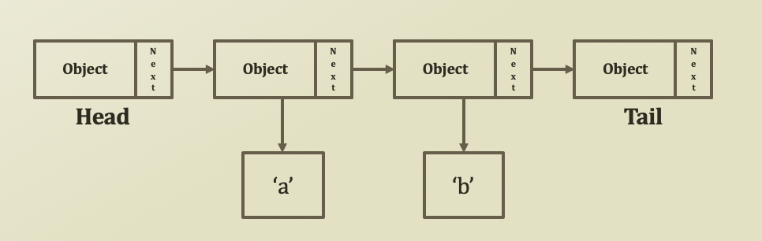

# 3. Linked List 1

## Basic Structure: Singly Linked List

* Construct a singly linked like with nodes and references 
  * A node consists of 
    * A variable to hold a reference to its next node
    * A variable to hold a reference to its value object
  * Special nodes: Head and Tail
    * You can construct the singly linked list without them
    * But, using them makes search, insert, and delete more convenient
  * Generally, requires more coding than array



## Implementation of Node class

* Member Variables
  * Variable to reference the next node
  * Variable to hold a value object
  * \(Optional\) Variable to check whether it is a head or not
  * \(Optional\) Variable to check whether it is a tail or not
* Member Functions
  * Various set/get methods

```python
class Node:
    nodeNext = None
    nodePrev = ''
    objValue = ''
    binHead = False
    binTail = False

    def __init__(self, objValue='', nodeNext=None, binHead=False, binTail=False):
        self.nodeNext = nodeNext
        self.objValue = objValue
        self.binHead = binHead
        self.binTail = binTail
    
    def setValue(self, objValue):
        self.objValue = objValue
    def getValue(self):
        return self.objValue
    
    def setNext(self, nodeNext):
        self.nodeNext = nodeNext
    def getNext(self):
        return self.nodeNext

    def isHead(self):
        return self.binHead
    def isTail(self):
        return self.binTail
    
node1 = Node(objValue = 'a')
nodeTail = Node(binTail=True)
nodeHead = Node(binHead=True, nodeNext=node1)
```


