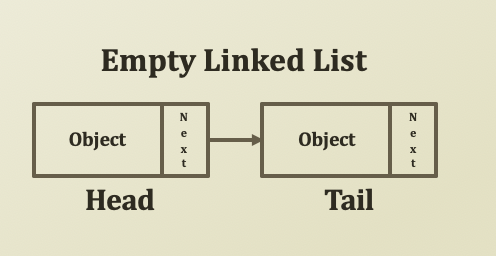
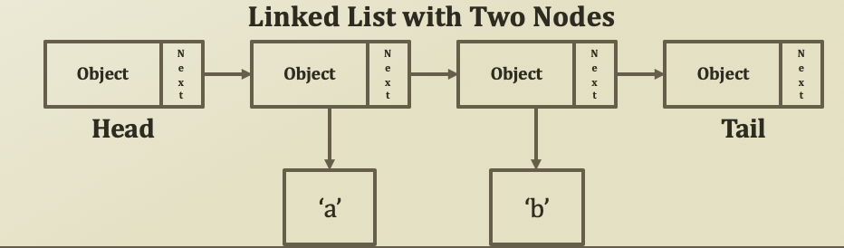
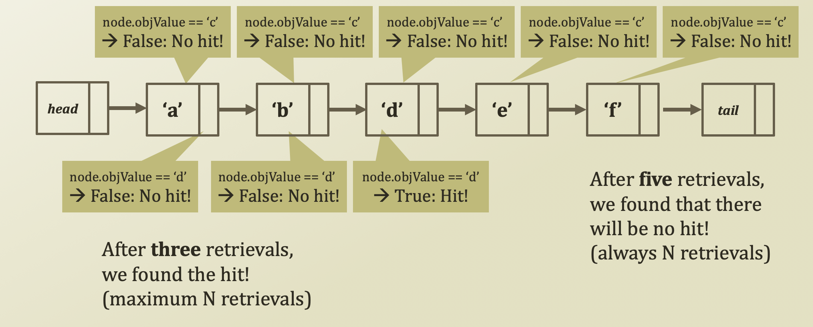
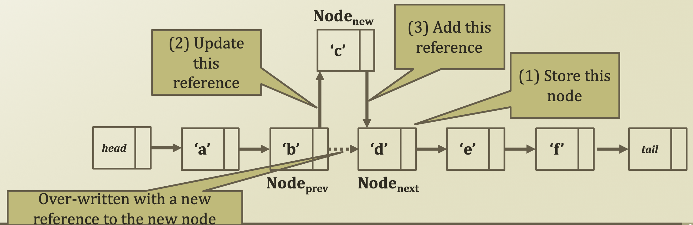

# 4. Linked List 2

## Head and Tail

* Specialized node
  * Head: Always on the first of the list
  * Tail: Always on the last of the list
  * There are the two corner stones showing the start and the end of the list
* These are optional nodes.
  * Linked list works okay without these
  * However, having these makes implementation very convenient
  * Any example?

## Search Procedure in Singly Linked List

* Again, let's find 'd' and 'c' from the list
* Just like an array, navigating from the first to the last until hit is the only way
* No difference in the search pattern, though you cannot use index any further!
  * Your list implementation may include the index function, but it is not required in the linked list

## Insert Procedure in Singly Linked List

* This is the moment that you see the power of a linked list
* Last time, you need N retrievals to insert a value in the array list
* This time, you need only three operations
  * With an assumption that you have a reference to the node, Node\_\(prev\) that you want to put your new node next
  * First, you store a Node, or a Node\_\(next\), pointed by a reference from Node\_\(prev\)'s nodNext member variable
  * Second, you change a reference from Node\_\(prev\)'s nodeNext to Node\_\(new\)
  * Third, you change a reference from Node\_\(new\)'s nedeNext to Node\_\(next\)

## Delete Procedure in Singly Linked List

