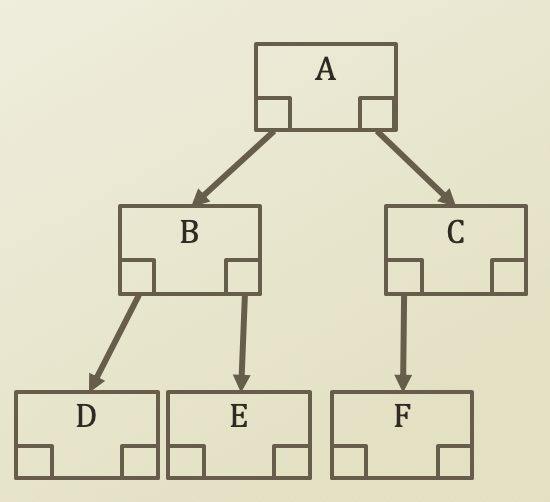
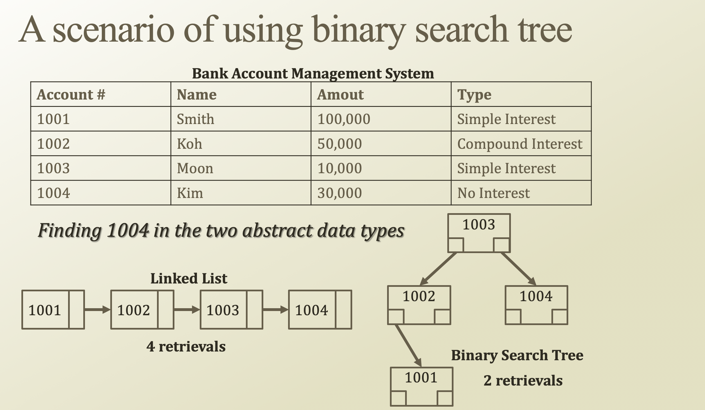

# 4. Binary Search Tree and Implementation

## Binary Search Tree: a simple structure



* Binary tree
  * Tree with **degree 2**
* Binary Search Tree \(BST\)
  * Tree with **degree 2**
  * Tree designed for a fast search of stored data
  * So far, what we have studied the definitions and the characteristics of stored data
  * Now, this is related to the operations
  * **How to perform a faster search?**



## Implementation of Tree Node


* Has three references 
  * Left Hand Side \(LHS\)
  * Right Hand Side \(RHS\)
  * Its own value
  * Its parent node
  * Not implemented here, but
    * LHS stores
      * Values have lower than its own value
    * RHS stores
      * Values have higher than its own value
    * Just as we all know that the department stores do not have a restroom on the first floor
* Other than four references,
  * Simple get/set methods
    * What are the get/set methods?
      * Coming from encapsulation

```python
class TreeNode:
    # 4 references
    nodeLHS = None
    nodeRHS = None
    nodeParent = None
    value = None
    
    def __init__(self, value, nodeParent):
        self.value = value
        self.nodeParent = nodeParent
        
    def getLHS(self):
        return self.nodeLHS
    def getRHS(self):
        return self.nodeRHS
    def getValue(self):
        return self.value
    def getParent(self):
        return self.nodeParent
    
    def setLHS(self, LHS):
        self.nodeLHS = LHS
    def setLHS(self, RHS):
        self.nodeRHS = RHS
    def setValue(self, value):
        self.value = value
    def setParent(self, nodeParent):
        self.nodeParent = nodeParent
```

## Implementation of BST

* BST handles the data stored through its root
  * Root has its own value
  * Tree instance access to the root
  * **Only through the root**, the tree instances access to the descendant nodes of th**e** root

```python
class BinarySearchTree:
    root = None
    
    def __init__(self):
        pass
    
    def insert(self, value, node = None):
        pass
    def search(self, value, node = None):
        pass
    def delete(self, value, node = None):
        pass
    
    def findMax(self, node = None):
        pass
    def findMin(self, node = None):
        pass
    
    def traverseLevelOrder(self):
        pass
    def traverseInOrder(self, node = None):
        pass
    def traversePreOrder(self, node = None):
        pass
    def traversePostOrder(self, node = None):
        pass
```

