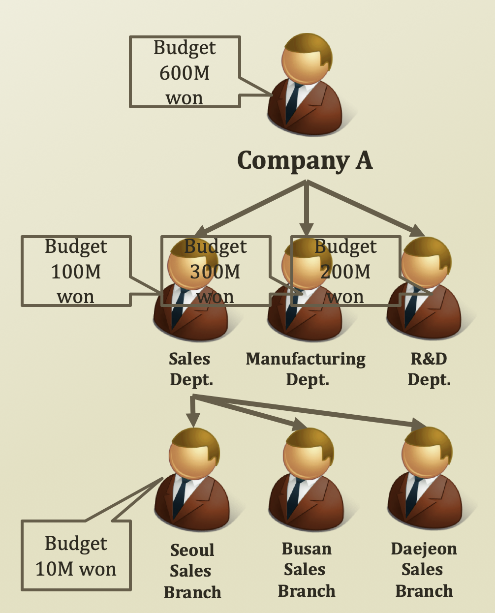
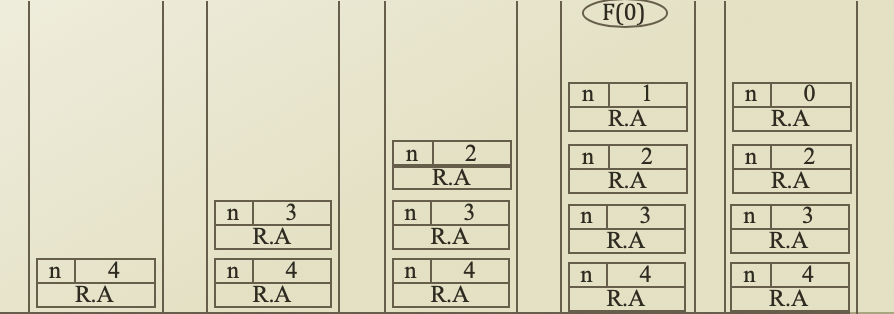

# 1\) Recursions

## Concepts of Recursions

* Repeating Problems
* **Divide and Conquer**
* Recursion Function Call
* Recursion Escape
* Recursion Depth

## Repeating Problems and Divide and Conquer



* Company A 는 Sales Dept., Manufacturing Dept., R&D Dept. 로 나누어져 있다.
* Company A 안의 Sales Dept. 안에는 또 Seoul, Busan, Deajeon Sales Branch 로 나누어져 있다. Manufacturing Dept. 역시 . . . 로 나누어져 있다. R&D 역시 . . . 로 나누어져 있을 것이다.
* 즉, Sales Dept. 는 결국 같은 형식의 작은 버전의 Company A 구조라 할 수 있다. 이렇게 계속되는 작은 Repeating Problem 을 통해 점점 더 큰 문제를 해결하는 방법을 **Divide and Conquer** 이라 한다.

```python
class Department
    dept = [sales, manufacturing, rnd]
    
    def calculateBudget(self):
        sum = 0
        for i in range(len(dept)):
            sum += dept[i].calculateBudget()
        return sum
```

## More Examples \(Repeating Problems\)

### 1. Factorial

```python
# Pseudocode
def factorial(n):
    if n == 0:
        return 1
    elif n > 0:
        return n * (n - 1) * (n - 2) * . . . * 1
```

We can change return expression as below

```python
def factorial(n):
    # Base Case, i.e. Termination Term
    if n == 0:
        return 1
    elif n > 0:
        return n * factorial(n - 1)
```

### 2. Great Common Divisor\(GCD\)

* Euclid's Algorithm 
  * **GCD\(A, B\) = GCD\(B, A mod B\)**
  * GCD\(A, 0\) = A
* Example
  * GCD\(32, 24\) =
  * GCD\(24, 8\) =
  * GCD\(8, 0\) = 8

### **Summary: Commonality**

* Repeating Function Calls
* Reducing Parameters
* Just like a mathematical induction


## Recursion

* A programing method to handle the repeating items in a  self-similar way
* Often in a form of calling a function within the function


```python
# Pseudocode
def functionA(target)
    ...
    functionA(target')
    ...
    if (escape_condition)
        return A
```

```python
def fibonacci(n):
    if n == 0:
        return 0
    if n == 1:
        return 1
    result = fibonacci(n - 1) + fibonacci(n - 2)
    return result
    
for i in range(0, 10):
    print(fibonacci(i), end = ' ')
```

### Recursions and Stackframe

* Recursion of functions
  * Increase the items in the stackframe
    * Stackframe is a stack storing your function call history
      * Push: When a function is invoked
      * Pop: When a function hits return or ends
      * What to store?
        * Local variables\(within function variables\) and function call parameters




* In stackframe, there are
  * R.A\(Return Address\): Store which function invoked
  * parameters 


