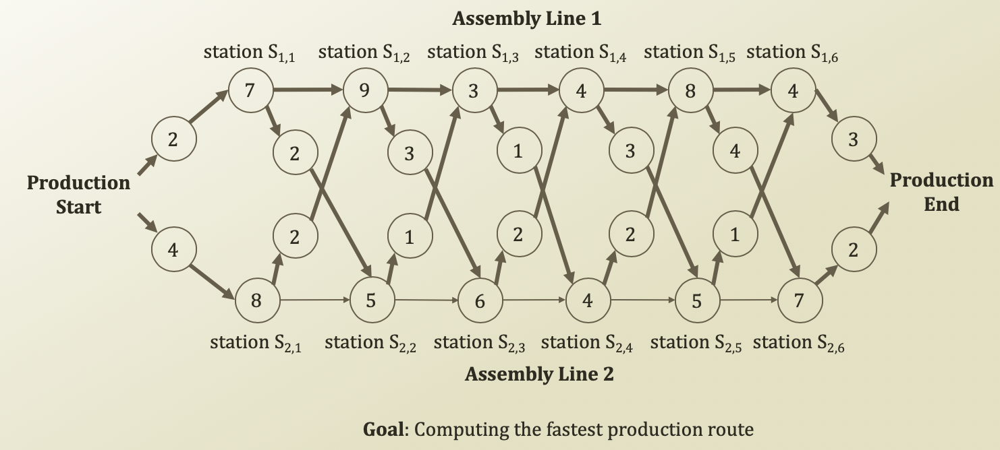
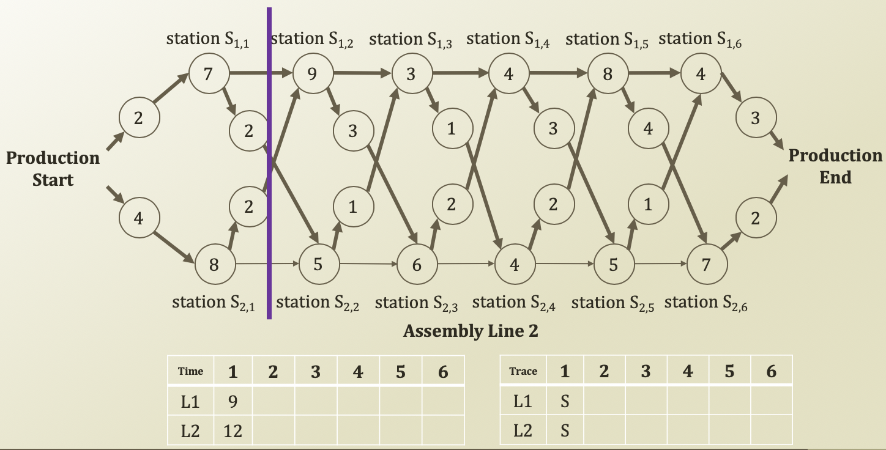
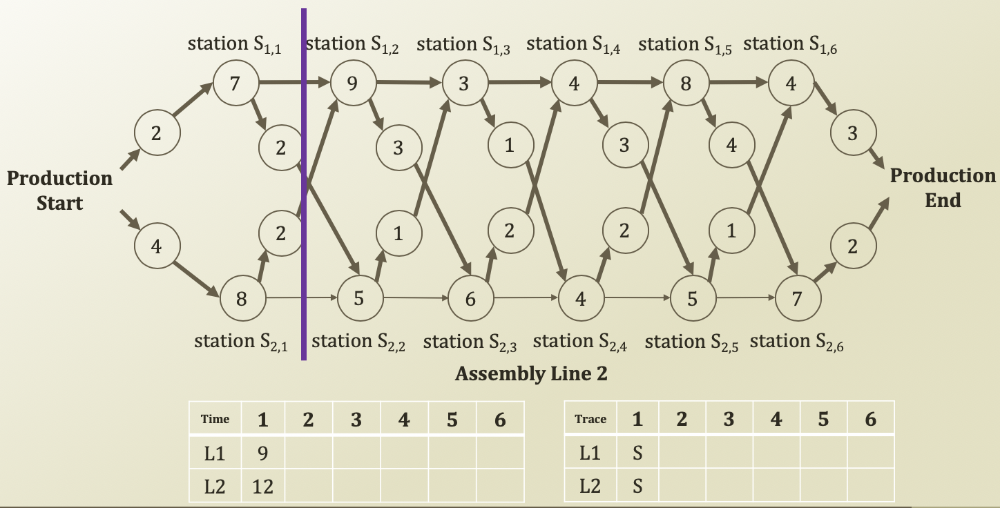
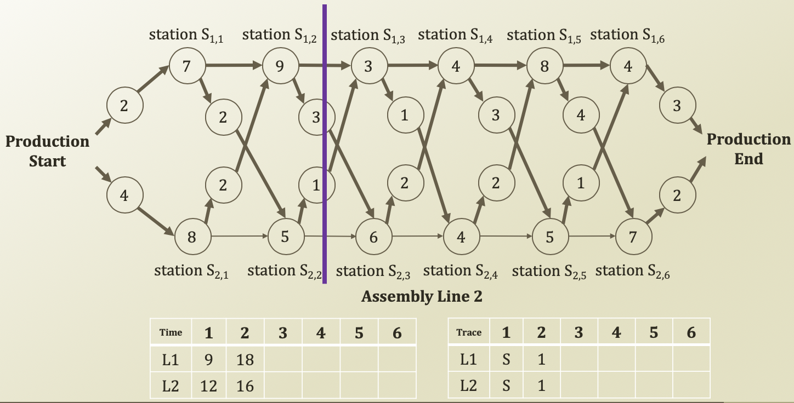
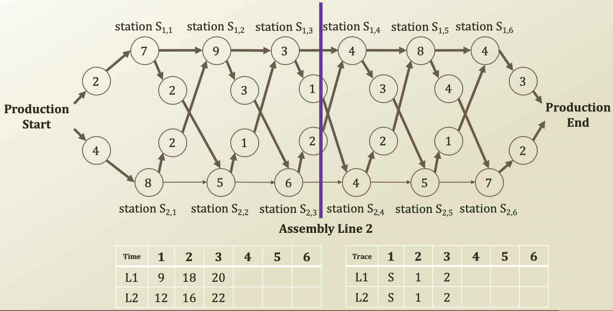
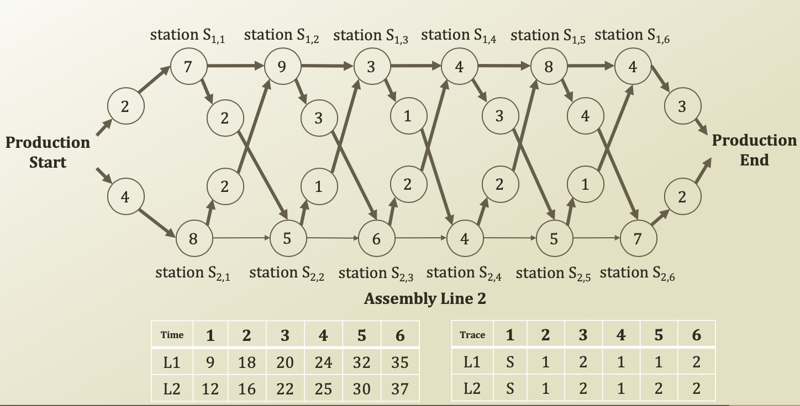
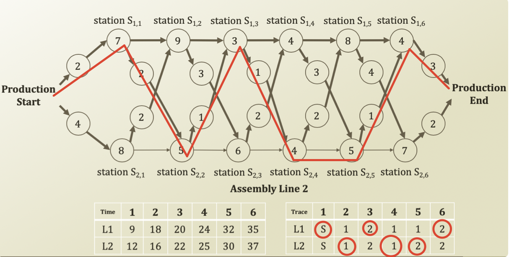

# 5\) Process of Assembly Line Scheduling

​




* Number in a circle: time
* Time table: min \(station S₁, station S₂\)
* Trace table: Retrace \(from past node\). Number in the trace table means where it comes from













```python
# Assembly Lines Using Recursion
class AssemblyLines:
    timeStation = [[7,9,3,4,8,4], [8,5,6,4,5,7]]
    timeBelt = [[2,2,3,1,3,4,3], [4,2,1,2,2,1,2]]
    count = 0

    def scheduling(self, idxLine, idxStation):
        print("Calculate scheduling: line, station: {}, {}, ({}, recursion calls)".format\
            (idxLine, idxStation, self.count))
        self.count = self.count + 1

        # Base Case. Termination Term
        if idxStation == 0:
            if idxLine == 1:
                return self.timeBelt[0][0] + self.timeStation[0][0]
            elif idxLine == 2:
                return self.timeBelt[1][0] + self.timeStation[1][0]

        # Setting up recursion calls
        if idxLine == 1:
            costLine1 = self.scheduling(1, idxStation - 1) + self.timeStation[0][idxStation]
            costLine2 = self.scheduling(2, idxStation - 1) + self.timeStation[0][idxStation] + self.timeBelt[1][idxStation]
        elif idxLine == 2:
            costLine1 = self.scheduling(1, idxStation - 1) + self.timeStation[1][idxStation] + self.timeBelt[0][idxStation]
            costLine2 = self.scheduling(2, idxStation - 1) + self.timeStation[1][idxStation]
        if costLine1 > costLine2:
            return costLine2
        else:
            return costLine1

    def startScheduling(self):
        numStation = len(self.timeStation[0])
        costLine1 = self.scheduling(1, numStation - 1) + self.timeBelt[0][numStation]
        costLine2 = self.scheduling(2, numStation - 1) + self.timeBelt[1][numStation]
        if costLine1 > costLine2:
            return costLine2
        else:
            return costLine1

lines = AssemblyLines()
time = lines.startScheduling()
print("Fastest production time:", time)

```

```python
# Assembly Lines Using Dynamic Programming
class AssemblyLines:
    timeStation = [[7,9,3,4,8,4], [8,5,6,4,5,7]]
    timeBelt = [[2,2,3,1,3,4,3], [4,2,1,2,2,1,2]]

    # Setting up a memoization table
    timeScheduling = [list(range(6)), list(range(6))]
    stationTracing = [list(range(6)), list(range(6))]

    def startSchedulingDP(self):
        # Base Case
        numStation = len(self.timeStation[0])
        self.timeScheduling[0][0] = self.timeStation[0][0] + self.timeBelt[0][0]
        self.timeScheduling[1][0] = self.timeStation[1][0] + self.timeBelt[1][0]

        for i in range(1, numStation):
            if self.timeScheduling[0][i - 1] > self.timeScheduling[1][i - 1] + self.timeBelt[1][i]:
                self.timeScheduling[0][i] = self.timeStation[0][i] + self.timeScheduling[1][i - 1] + self.timeBelt[1][i] 
                self.stationTracing[0][i] = 1
            else:
                self.timeScheduling[0][i] = self.timeStation[0][i] + self.timeScheduling[0][i - 1]
                self.stationTracing[0][i] = 0

            if self.timeScheduling[1][i - 1] > self.timeScheduling[0][i - 1] + self.timeBelt[0][i]:
                self.timeScheduling[1][i] = self.timeStation[1][i] + self.timeScheduling[0][i - 1] + self.timeBelt[0][i]
                self.stationTracing[1][i] = 0
            else:
                self.timeScheduling[1][i] = self.timeStation[1][i] + self.timeScheduling[1][i - 1]
                self.stationTracing[1][i] = 1

        costLine1 = self.timeScheduling[0][numStation - 1] + self.timeBelt[0][numStation]
        costLine2 = self.timeScheduling[1][numStation - 1] + self.timeBelt[1][numStation]

        if costLine1 > costLine2:
            return costLine2, 1
        else:
            return costLine1, 0

    def printTracing(self, lineTracing):
        numStation = len(self.timeStation[0])
        print("Line: {}, Station: {}".format(lineTracing, numStation))

        for i in range(numStation - 1, 0, -1):
            lineTracing = self.stationTracing[lineTracing][i]
            print("Line: {}, Station: {}".format(lineTracing, i))

lines = AssemblyLines()
time, lineTracing = lines.startSchedulingDP()
print("Fastest production time:", time)
lines.printTracing(lineTracing)

```

