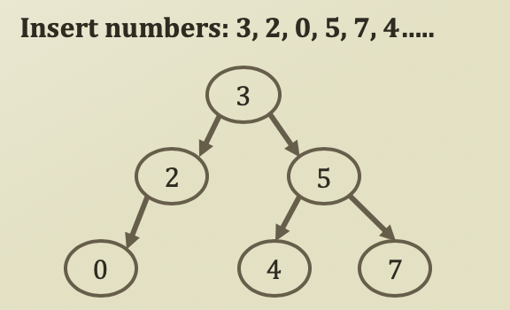

# 5. Insert and Search Operation of Binary Search Tree

## Insert Operation of Binary Search Tree

* Insertion Operation
  * Retrieve the current node value
    * If the value is equal to the value to insert
      * Return already there!
    * If the value is smaller than the value to insert
      * If there is a node in the RHS, then move to the RHS node \(Recursion\)
      * If there is no node in the RHS, create a RHS node with the value to insert
    * If the value is larger than the value to insert 
      * If there is a node in the LHS, then move to the LHS node \(Recursion\)
      * If there is no node in the LHS, create a LHS node with the value to insert

```python
def insert(self, value, node = None):
    # Base Case, Termination Term
    if node is None:
        node = self.root
    if self.root is None:
        self.root = TreeNode(value, None)
        return

    if value == node.getValue():
        return
    if value > node.getValue():
        if node.getRHS() is None:
            node.setRHS(TreeNode(value, node))
        # Recursion
        else:
            self.insert(value, node.getRHS())
    if value < node.getValue():
        if node.getLHS() is None:
            node.setLHS(TreeNode(value, node))
        # Recursion
        else:
            self.insert(value, node.getLHS())
    return
```



## Search Operation fo Binary Search Tree

* Search Operation
  * Retrieve the current node value
    * If the value is equal to the value to search
      * Return **True**
    * If the value is smaller than the value to search
      * If there is a node in the RHS, then move to the RHS node \(Recursion\)
      * If there is no node in RHS, return **False**
    * If the value is larger than the value to search
      * If there is a node in the LHS, then move to the LHS node \(Recursion\)
      * If there is no node in LHS, return **False** 

```python
def search(self, value, node = None):
    # Base Case, Termination Term
    if node is None:
        node = self.root
    if value == node.getValue():
        return True
    if value > node.getValue():
        if node.getRHS() is None:
            return False
        # Recursion (Reduced Size)
        else:
            return self.search(value, node.getRHS())
    if value < node.getValue():
        if node.getLHS() is None:
            return False
        # Recursion (Reduced Size)
        else:
            return self.search(value, node.getLHS())
```


