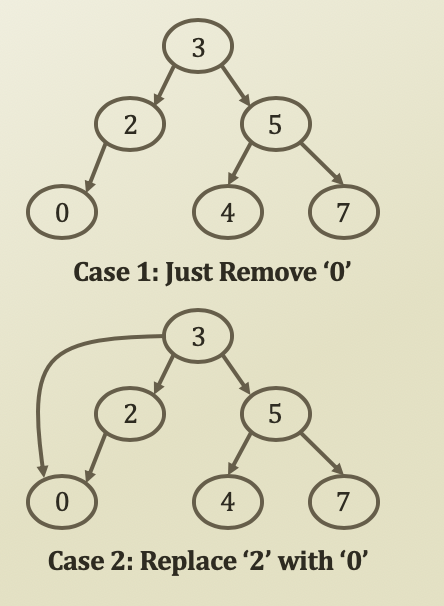

# 6. Delete Operation and Minimum & Maximum of Binary Search Tree

## Delete Operation of Binary Search Tree 1



* First, you need to find the node to delete through recursions
* Three deletion cases
  * Case 1: Deleting a node with no children
    * Just remove the node by modifying its parent
  * Case 2: Deleting a node with one child
    * Replace the node with the child
  * Case 3: Deleting a node with two children
    * Find either
      * A **maximum in the LHS** or a **minimum in the RHS**
      * Substitute the node to delete with the found value
      * Delete the found node in the LHS or the RHS

## Delete Operation of Binary Search Tree 2

```python
def delete(self, value, node = None):
    # Base Case, Termination Term
    if node is None:
        node = self.root

    # Case 2: Deleting a node with 1 child
    if node.getValue() < value:
        return self.delete(value, node.getRHS())
    if node.getValue() > value:
        return self.delete(value, node.getLHS())

    # Case 3: Deleting a node with 2 child
    if node.getValue() == value:
        if node.getLHS() is not None and node.getRHS() is not None:
            nodeMin = self.findMin(node.getRHS())
            node.setValue(nodeMin.getValue())
            self.delete(nodeMin.getValue(), node.getRHS())
            return
        
        parent = node.getParent()

        if node.getLHS() is not None:
            if node == self.root:
                self.root = node.getLHS()
            elif parent.getLHS() == node:
                parent.setLHS(node.getLHS())
                node.getLHS().setParent(parent)
            else:
                parent.setRHS(node.getLHS())
                node.getLHS().setParent(parent)
        
        if node.getRHS() is not None:
            if node == self.root:
                self.root = node.getRHS()
            elif parent.getLHS() == node:
                parent.setLHS(node.getRHS())
                node.getRHS().setParent(parent)
            else:
                parent.setRHS(node.getRHS())
                node.getRHS().setParent(parent)
            return
        
        # If there is no children,
        if node == self.root:
            self.root = None
        elif parent.getLHS() == node:
            parent.setLHS(None)
        else:
            parent.setRHS(None)
        return
```

## Minimum and Maximum in BST

* Finding minimum in a BST
  * Just keep following the LHS
    * Because this will always result in the smaller value than the value of the current node
    * When you can't any LHS, then the value of the current node is the smallest
* Finding maximum in a BST
  * Just keep following the RHS
    * Because this will always the result in the larger value than the value of the current node
    * When you can't any RHS, then the value of the current node is the largest

```python
def findMax(self, node = None):
    if node is None:
        node = self.root
    if node.getRHS() is None:
        return node
    # Recursion
    return self.findMax(node.getRHS())

def findMin(self, node = None):
    if node is None:
        node = self.root
    if node.getLHS() is None:
        return node
    return self.findmin(node.getLHS())
```


