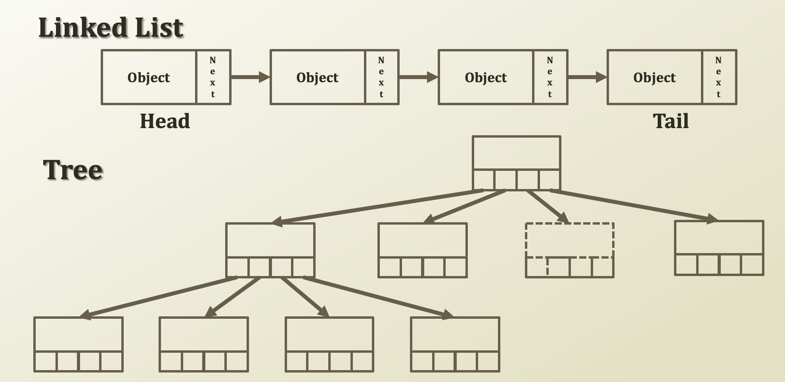

# 1. Tree as an Abstract Data Type and Structure

## Detour: Abstract Data Types\(ADT\) 

* An abstract data type \(ADT\) is an abstraction of a data structure
  * An ADT specifies:
    * Data **stored**
    * **Operations** on the data
    * Error conditions associated with operations
* Example: ADT modeling a simple stock trading system
  * The data stored are buy/sell orders
  * The operations supported are:
    * order buy \(stock, shares, price\)
    * order sell \(stock, shares, price\)
    * void cancel \(order\)
* Error conditions:
  * Buy/sell a nonexistent stock
  * Cancel a nonexistent order

## Tree as an abstract data type

* **Tree structure**
  * Abstract data type
  * Data stored
    * A a tree structure
  * Operations
    * The ordinary data structure's operations just as linked lists
      * Insert
      * Delete
      * Search
    * Special searching approaches for trees and networks
      * Traverse

## Why do we use trees?

* Because the structure of trees is a good analogy to the various real world structures
  * Corporate structures
  * Group bank account
  * Command and control structures
* Why is the structure one of the most favorite structures?
  * A clear approach of **Divide and Conquer**

\*\*\*\*

## Structure of stored data 

* Although a linked list has only one next, a tree has multiple 'next′s
  * Each node has multiple next nodes
  * Particularly, this structure maintains the next nodes as an array or variables

