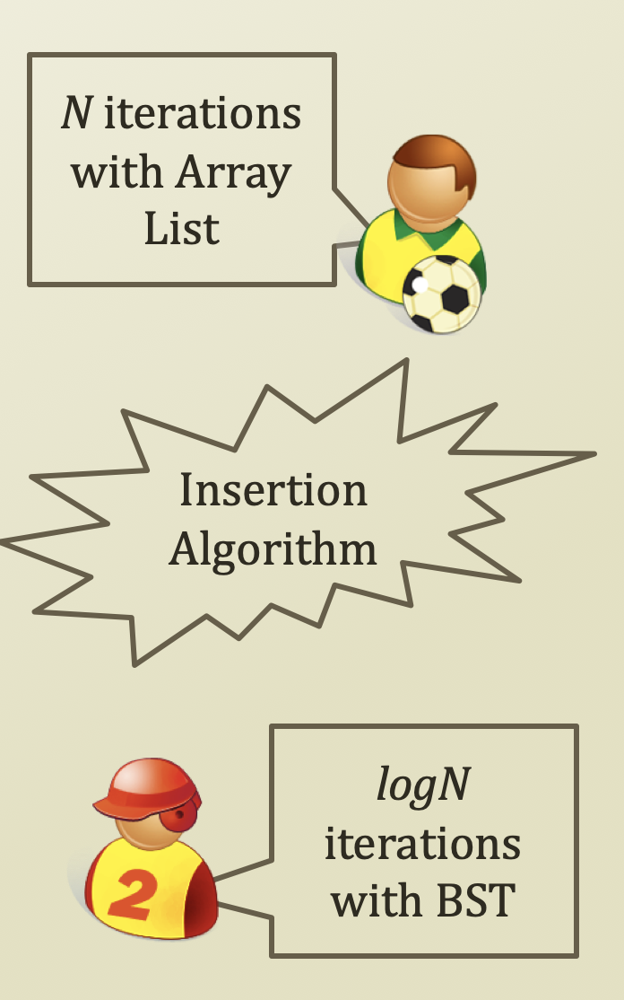

# 1. Factors of Program's Efficiency

## Factors of Program's Efficiency

* Algorithm
  * A clearly specified set of simple instructions to be followed to solve a problem
    * Takes a set of values as inputs
    * Produces a set of values as outputs
  * Specified in 
    * English
    * A computer program
    * Pseudo-code
* Data Structures
  * Methods of organizing data
* Program
  * = Algorithm + Data Structures

