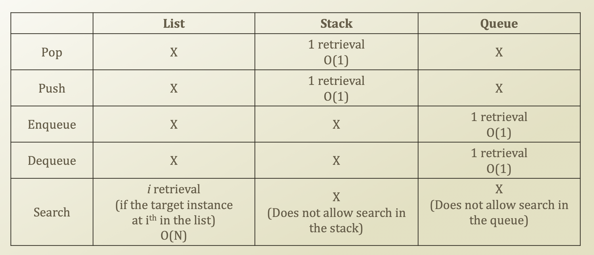
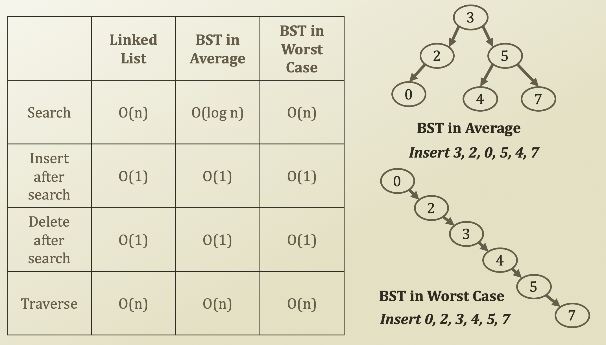

# 7. Examples & Rules of Big-Oh Notation

## Examples of Big-Oh Notation

* Assume f\(N\) = 7N². Then
  * f\(N\) = O\(N⁴\)
  * f\(N\) = O\(N³\)
  * f\(N\) = O\(N²\) \(best answer, asymptotically tight\)
* N² / 2 - 3N
  * O\(N²\)
* 1 + 4N
  * O\(N\)
* 7N² + 10N + 3
  * O\(N²\)
* $$log_{10}N = \frac{log_{2}N}{log_{2}10}$$ 
  * O\(log₂N\) = O\(logN\)
* sin\(N\)
  * O\(1\)
  * ∵ maximum size of sin is 1 and oscillating, so it's not growth
* 10
  * O\(1\)
* $$10^{10}$$ 
  * O\(1\)
* logN + N
  * O\(N\)

## Rules of Big-Oh Notation 

* When considering the growth rate of a function using Big-Oh
  * Ignore the lower order terms and the coefficients of the highest-order term
    * When we have N³, then N² and N means nothing in terms of Big-Oh
    * From the growth rate order
      * $$cⁿ > nᵏ > n² > nlogn > n > logn > c$$ 
      * c ≥ 2 and k &gt; 2
    * No need to specify the base of the logarithm 
      * $$O(logN) = O(log_cN)$$ 
* If $$T_1(N) = O(f(N)) \ \text{and} \ T_2(N) = O(g(N)), \ \text{then}$$ 
  * $$T_1(N) + T_2(N) = max(O(f(N)), O(g(N)))$$
    * $$\text{Example)} \max(O(N), O(N^2)) = O(N^2)$$
    * When terms are in sequence 
  * $$T_1(N) * T_2(N) = O(f(N) * g(N))$$ 
    * $$\text{Example)} \ O(N) * O(logN) = O(NlogN)$$ 
    * When one term in another term

## Big-Oh Notation of list, stack, and queue

## Detour: Performance of Binary Search Tree

