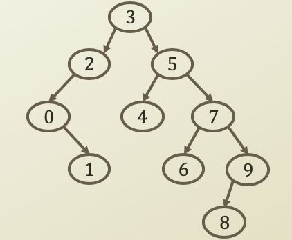
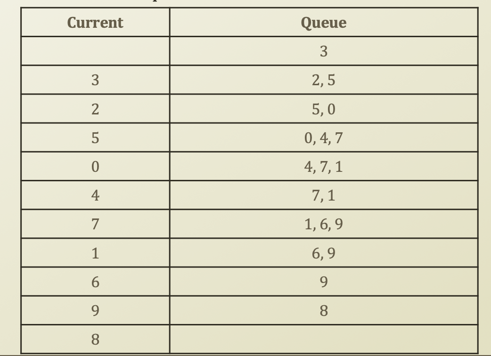
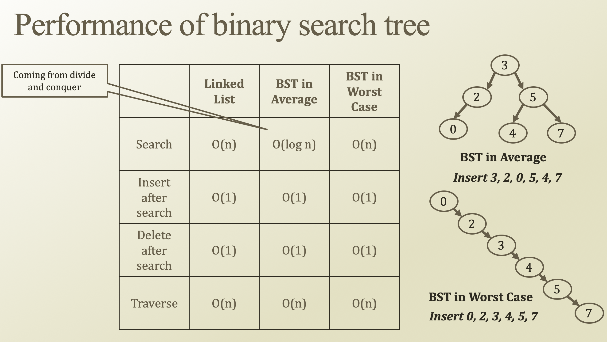

# 7. Tree Traversing

## Tree Traversing

* Tree
  * Complicated than a list
  * Multiple ways to show the entire dataset
    * If it was a list
      * Just show the values from the beginning to the end
    * Sine this is a BST
      * You have to choose what to show at a time
        * The value in LHS
        * The value in RHS
        * The value that you have
  * Hence there are multiple traversing approaches

## Depth First Traverse



* Pre-order traverse
  * Order: Current, LHS, RHS in Recursion
  * 3, 2, 0, 1, 5, 4, 7, 6, 9, 8
* In-order traverse
  * Order: LHS, Current, RHS in Recursion
  * 0, 1, 2, 3, 4, 5, 6, 7, 8, 9
  * Same as sorted order
* Post-order traverse
  * Order: LHS, RHS, Current in Recursion
  * 1, 0, 2, 4, 6, 8, 9, 7, 5, 3

```python
def traversePreOrder(self, node = None):
    if node is None:
        node = self.root
    ret = []
    ret.append(node.getValue())
    if node.getLHS() is not None:
        ret += self.traversePreOrder(node.getLHS())
    if node.getRHS() is not None:
        ret += self.traversePreOrder(node.getRHS())
    return ret

def traverseInOrder(self, node = None):
    if node is None:
        node = self.root
    ret = []
    if node.getLHS() is not None:
        ret += self.traverseInOrder(node.getLHS())
    ret.append(node.getValue())
    if node.getRHS() is not None:
        ret += self.traverseInOrder(node.getRHS())
    return ret

def traversePostOrder(self, node = None):
    if node is None:
        node = self.root
    ret = []
    if node.getLHS() is not None:
        ret += self.traversePostOrder(node.getLHS())
    if node.getRHS() is not None:
        ret += self.traversePostOrder(node.getRHS())
    ret.append(node.getValue())
    return ret
```

#### ∴ Depth First Traverse using a recursion, which uses stackframe.

## Breadth First Traverse




* Queue-based level-order traverse
* 3, 2, 5, 0, 4, 7, 1, 6, 9, 8
* Enqueue the root
  * While until queue is empty
    * Current = Dequeue one element
    * Print current
    * If current's LHS exist
      * Enqueue current LHS
    * If current's RHS exist
      * Enqueue current RHS

```python
def traverseLevelOrder(self):
    ret = []
    Q = Queue()
    Q.enqueue(self.root)
    while not Q.isEmpty():
        node = Q.dequeue()
        if node is None:
            continue
        ret.append(node.getValue())
        if node.getLHS() is not None:
            Q.enqueue(node.getLHS())
        if node.getRHS() is not None:
            Q.enqueue(node.getRHS())
    return ret
```

## Performance of Binary Search Tree



* Since BST is depends on a height, BST in Worst Case is bad because height is larger. Then, it is not different as linked list.
* Then, we need to use LHS and RHS properly for BST in Average, i.e., well-balanced BST. Then, we can search in O\(log n\) not O\(n\)

